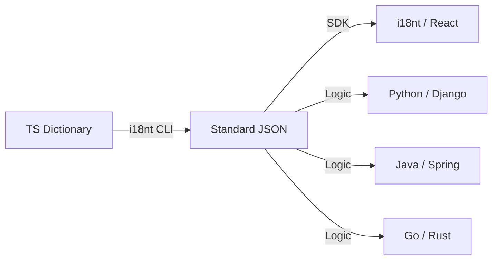

# i18nt

> Extremely lightweight internationalization framework — Zero dependencies · Proxy driven · ICU standardized · Nested namespaces

[简体中文](./README.md) | English

[](https://www.npmjs.com/package/i18nt)
[](https://bundlephobia.com/package/i18nt)

## ✨ Features

- **Zero Dependencies**: Core code < 3KB (gzip), without any third-party libraries.
- **Ultimate DX**: Powered by **Recursive Proxy**, supports infinite nested access like `t.auth.login` with perfect IntelliSense.
- **ICU Standardized**: Built-in lightweight ICU parser (1.2KB), supporting `plural`, `select`, `selectordinal`, `offset`, and nested syntax.
- **Intl Native Driven**: Formats numbers, dates, and relative time natively using the browser's `Intl` API.
- **Dual Syntax Compatibility**: Perfectly supports both traditional `{{var}}` interpolation and industrial-grade ICU MessageFormat.
- **RTL Adaptive**: Automatically detects language direction and syncs DOM `dir` attribute.
- **CLI Tool**: One-click export/import of JSON translation templates from TypeScript dictionaries.
- **Ultimate Benchmark**: Lighter, more precise, and more modern compared to i18next & FormatJS ([View Comparison](#why-choose-i18nt)).

## 📦 Installation

```bash
npm install i18nt
```

## 🚀 Quick Start

### 1. Define Translation Dictionary (Supports Nesting)

```ts
// src/translations.ts
export const LANG_ORDER = ["zh-CN", "en-US"] as const;

export const TRANSLATIONS = {
  // Basic text (matched by index)
  buttons: {
    save: ["保存", "Save"],
    cancel: ["取消", "Cancel"],
  },

  // ICU MessageFormat (Powerful, Flexible)
  // Supports plurals, offsets, variables
  cart_status: [
    "{count, plural, offset:1 =0{空空如也} =1{只有您自己} other{您和另外 # 人}}",
    "{count, plural, offset:1 =0{Empty} =1{Just you} other{You and # others}}",
  ],

  // Variable Interpolation (Simple Mode)
  greeting: ["你好，{{name}}！", "Hello, {{name}}!"],
};
```

### 2. Create i18n Instance

```ts
import { createI18n } from "i18nt";
import { TRANSLATIONS, LANG_ORDER } from "./translations";

const i18n = createI18n({
  translations: TRANSLATIONS,
  langOrder: LANG_ORDER,
  locale: "zh-CN",
});

const { t } = i18n;

// 1. Infinite nested access (Proxy driven)
t.buttons.save; // → "保存"

// 2. ICU Formatting
t("cart_status", { count: 3 }); // → "您和另外 2 人" (offset:1)

// 3. Numbers & Date Helpers
t.n(12345.6, { style: "currency", currency: "USD" }); // → "$12,345.60"
t.d(new Date(), { dateStyle: "long" }); // → "2026年2月28日"

// 4. Switch Language
i18n.setLocale("en-US");
t.buttons.save; // → "Save"
```

## 🌐 Lazy Loading

i18nt remains zero-dependency and doesn't explicitly bind to AJAX, but it provides `extraDicts` for **deep recursive merging**:

```ts
// Simulate fetching partial translations remotely (e.g., auth module)
const remoteAuthDict = {
  auth: {
    login: "Login Now",
    forgot: "Forgot Password?",
  },
};

i18n.setLocale("en-US"); // Switch to dynamic language
// Inject dictionary fragments; it automatically merges into the existing namespace tree
// Configuration update example:
// i18n.setLocale("en-US", { extraDicts: [remoteAuthDict] });
```

## 🔧 CLI Tool

```bash
# Export JSON templates
npx i18nt export --lang en-US

# Batch import translated JSONs
npx i18nt import --json ./locales/
```

<a id="why-choose-i18nt"></a>

## ⚔️ Why choose i18nt?

| Feature / Library                 | i18nt |   i18next   | FormatJS |
| :-------------------------------- | :---: | :---------: | :------: |
| **Extremely Lightweight (< 3KB)** |  ✅   |     ❌      |    ❌    |
| **Zero Dependencies**             |  ✅   |     ❌      |    ❌    |
| **Proxy Driven (Type hinting)**   |  ✅   |     ❌      |    ❌    |
| **Native Intl Standard**          |  ✅   |     ✅      |    ✅    |
| **Core ICU Syntax Support**       |  ✅   | ✅ (Plugin) |    ✅    |
| **Nested Namespaces**             |  ✅   |     ✅      |    ❌    |
| **Lazy Loading**                  |  ✅   |     ✅      |    ❌    |
| **Auto RTL Detection & Sync**     |  ✅   |     ❌      |    ❌    |

### Core Advantages (Deep Dive)

1. **Zero Render Cost**: Built on **Recursive Proxy**. Accessing `t.auth.login` generates proxies on demand, rather than pre-processing a massive path tree at startup. Initialization performance is constant **O(1)**.
2. **Minimal ICU Parser**: A built-in parser engine of just **1.2KB**, directly mapping to the native `Intl` API—a perfect balance of performance and size.
3. **Localization Friendly Developer Experience**: Perfectly supports "bilingual interpolation" and "explicit syntax," eliminating the pain points of multi-language coding context switching.

## 🌍 Cross-Language Support

i18nt currently primarily supports the following programming languages and ecosystems:

1. Core Development Languages
   TypeScript (TS): Natively supported. The framework is written in TypeScript, providing automatic type inference and offering smooth IntelliSense when accessing t.key.
   JavaScript (JS): Fully supported. Compatible with modern JavaScript (ESM) and can be used in any ESG+ environments.
2. Frontend Framework Adapters
   React: Official built-in adapter (provides `I18nProvider` and `useI18n` Hook).
   Vanilla Web (Vanilla JS): Fully supported. Given its lack of React dependency, it acts as a low-level i18n engine for plain HTML/JS pages, Vue, Svelte, or Angular projects.
3. Runtime Environments
   Browser: Primary environment, deeply leveraging native browser Intl APIs.
   Node.js: CLI tools (like `i18nt export/import`) run in Node.js.
4. Translation Syntaxes (i18n Standards)
   ICU MessageFormat: Supports this industry standard.
   Mustache Style: Supports `{{var}}` simple placeholders.

Whether developing a JavaScript or TypeScript project, React application, or standard Web project, i18nt provides the optimal support.

---

## 🛠️ Best Practices: Modularity & Scale

For large projects, it's recommended to split the translation dictionary into multiple modules and aggregate them using TypeScript's import features:

### 1. Split Files

```ts
// src/i18n/auth.ts
export const auth = {
  login: ["登录", "Login"],
  register: ["注册", "Register"],
};

// src/i18n/settings.ts
export const settings = {
  theme: ["主题", "Theme"],
};
```

### 2. Central Hub

```ts
// src/translations.ts
import { auth } from "./i18n/auth";
import { settings } from "./i18n/settings";

export const LANG_ORDER = ["zh-CN", "en-US"] as const;
export const MAIN_LANG = "zh-CN";

export const TRANSLATIONS = {
  auth,
  settings,
  common: {
    home: ["首页", "Home"],
  },
};
```

### 3. Type Safety & CLI

The `i18nt` CLI tool supports **recursive parsing** of nested structures. Even if your dictionary spans multiple files (as long as they are aggregated via spread operators or object nesting in the main entry file), the CLI accurately exports them into a nested JSON directory and perfectly supports reverse syncing.

---

## 🌍 Cross-Language Infrastructure Ecosystem

1. **Standard JSON Export**: Convert TS dictionaries to universal JSON using `npx i18nt export`.
2. **ICU Standard Compatibility**: Plural and formatting syntax completely adheres to the **ICU MessageFormat** standard. Mature ICU parsing libraries in Java, Python, Go, Rust, and C++ can directly read and run logic exported by `i18nt`.
3. **Workflow Hub**: Maintain the TypeScript dictionary as your "Single Source of Truth" and leverage the CLI to sync with backends (e.g., Spring, Django, Gin, Actix).

When using Python, Go, Java, Rust, etc., i18nt serves as an internationalization hub via its CLI toolchain and standard protocols.

Here are strategies for cross-language compatibility:

1. Data Exchange via Standard JSON (Highly Recommended)
   i18nt's CLI tool exports TS dictionaries into standard cross-language JSON formats.

Export Step: Run `npx i18nt export --lang all`.
Cross-Language Consumption:
Python: Use the `icu` or `babel` library.
Java: Native support for `MessageFormat` (ICU).
Go: Use `golang.org/x/text/message`.
Rust: Use the `icu_messageformat` crate.
Advantage: You can centrally manage translations in TypeScript (enjoying type hinting), while other backend languages merely read the generated JSON.

2. Protocol Compatibility Built on ICU MessageFormat
   Since i18nt's core syntax complies with the universal ICU standard, the pluralization logic (e.g., `{count, plural, ...}`) you write in i18nt is entirely generic across other languages' ICU parsers and requires zero syntax conversion.

3. Acting as a "Translation Management Hub" (Workflow)
   You can establish the following workflow:
   Definition End: Use TypeScript in the frontend to define the main translation file (the single source of truth).
   Sync End: Continuously output language-specific JSONs via `i18nt export`.
   Consumption End:
   Frontend: Calls the `i18nt` library.
   Backend (Java/Python, etc.): Mounts the `locales/*.json` directory for parsing.
   Closed Loop: If the localization team alters a language's JSON, a single `i18nt import` syncs it back to your TS dictionary.

4. Cloud/Remote Loading Solutions
   If your application is cross-platform (e.g., running both Web pages and C++ desktop clients), store the exported JSON from i18nt on a CDN. Each platform fetches identical translation configs over the network, guaranteeing 100% multi-language consistency everywhere.

Core Logic Flow:



i18nt is more than just a JS library; it is a toolchain built on TS-driven definitions + JSON exchange + ICU standards. As long as the target language can read JSON and understand ICU formatting, the integration is flawless.

---

## 📄 License

MIT
