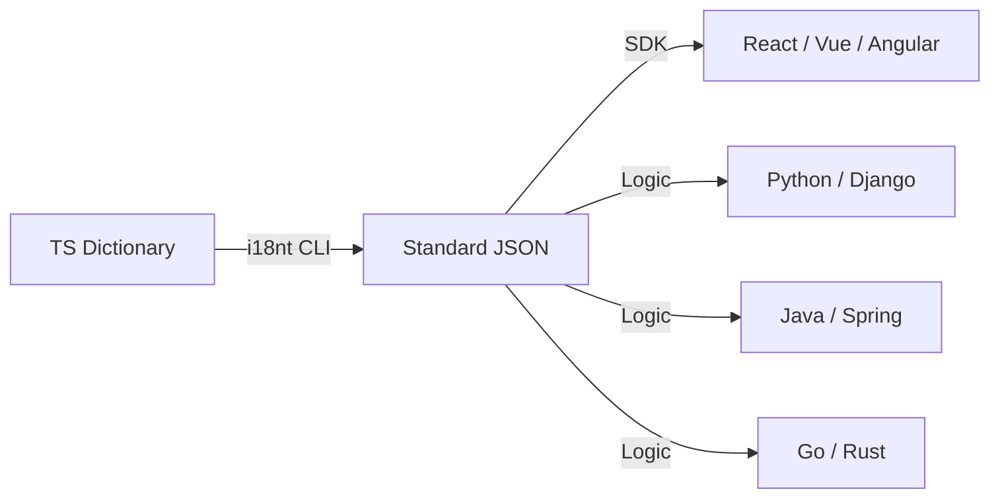

# i18nt

> Ultra-lightweight i18n framework — Zero-dependency · Proxy-driven · ICU Standard · Nested Namespace

[简体中文](./README.md) | English

[](https://www.npmjs.com/package/@xiaode-ai/i18nt)
[](https://bundlephobia.com/package/@xiaode-ai/i18nt)
[](https://github.com/xiaode-ai/i18nt/blob/main/LICENSE)

## ✨ Features

- **🚀 Instant Start**: Based on **Recursive Proxy**, paths are generated on-the-fly. Initialization performance is **O(1)**, supporting infinite nesting with perfect Intellisense.
- **📦 Zero-dependency**: Core code **< 3KB** (gzip). No third-party libraries required.
- **🎯 ICU Standard**: Built-in lightweight ICU parser, supporting `plural`, `select`, `skeleton` (::yMMMd) and other advanced syntax.
- **🛡️ Deep Type Safety**: **[NEW]** Automatically extracts variables from ICU strings, enabling compile-time validation and smart completion.
- **🎨 Rich Text Support**: Built-in `<tag>` syntax support for easy insertion of React/Vue components or HTML tags.
- **⚛️ Full Framework Support**: Native support for React (Hook/RSC), Vue 3, Angular, Next.js, and React Native.
- **🛠️ Intelligent CLI**: **[NEW]** Supports source code extraction, dictionary auto-fix, and **AI-powered translation completion**.
- **🌐 Plugin Ecosystem**: Browser detection, persistence, and **[NEW] cross-tab state synchronization**.

## 📦 Installation

```bash
npm i @xiaode-ai/i18nt
```

## 🚀 Quick Start

### 1. Define Dictionary

```ts
// src/i18n/dict.ts
export const LANG_ORDER = ["zh-CN", "en-US"] as const;

export const TRANSLATIONS = {
  // Basic text
  buttons: {
    save: ["保存", "Save"],
  },
  // ICU MessageFormat
  cart: [
    "{count, plural, =0{空购物车} other{购物车中有 # 件商品}}",
    "{count, plural, =0{Empty} other{# items in cart}}",
  ],
};
```

### 2. Initialize and Use

```ts
import { createI18n } from "@xiaode-ai/i18nt";
import { TRANSLATIONS, LANG_ORDER } from "./i18n/dict";

const i18n = createI18n({
  translations: TRANSLATIONS,
  langOrder: LANG_ORDER,
  locale: "en-US",
});

const { t } = i18n;

// Proxy-driven property access with perfect autocomplete
console.log(t.buttons.save); // "Save"

// Functional call for ICU logic
console.log(t("cart", { count: 3 })); // "3 items in cart"

// Rich text support
const result = t("agree", { 
  link: (text) => `<a href="/terms">${text}</a>` 
}); // ["Please read ", "<a href="/terms">Terms of Service</a>"]
```

## ⚛️ React Integration

`i18nt` provides an official React adapter for global state management and component re-rendering.

### Setup Provider

```tsx
import { I18nProvider } from "@xiaode-ai/i18nt/react";

function Root() {
  return (
    <I18nProvider config={{ translations, langOrder, locale: 'en-US' }}>
      <App />
    </I18nProvider>
  );
}
```

### Use in Components

```tsx
import { useI18n } from "@xiaode-ai/i18nt/react";

function UserProfile() {
  const { t, setLocale, locale } = useI18n();

  return (
    <div>
      <p>{t.profile.welcome}</p>
      <button onClick={() => setLocale('zh-CN')}>Switch to Chinese</button>
    </div>
  );
}
```

## 🛠️ CLI Advanced: Distributed Translation

For large projects, it's recommended to split dictionaries across modules. `i18nt` CLI can aggregate them automatically.

### Directory Example
```text
src/
  auth/
    i18n.ts      // Defines 'auth' namespace
  settings/
    i18n.ts      // Defines 'settings' namespace
```

### Automation
```bash
# 1. Validate and auto-fix dictionary (fill missing translations, formatting, etc.)
npx i18nt fix --input src/

# 2. [NEW] Use AI to auto-complete missing translations
$env:I18NT_AI_API_KEY="sk-xxx"
npx i18nt translate

# 3. Recursively scan src/, aggregate namespaces, and export to JSON
npx i18nt export --input src/ --lang all --json ./.i18nt/locales/

# 4. [NEW] Scan source code and extract keys
npx i18nt extract --input src/

# 5. [NEW] Export to native formats (Python, PHP, Go, Android, iOS)
npx i18nt export --format py      # Export .py dictionary
npx i18nt export --format xml     # Export Android strings.xml
npx i18nt export --format strings # Export iOS .strings
```

## 🌍 Cross-Language & Multi-platform Support

`i18nt` core is zero-dependency and provides comprehensive solutions for various frameworks and backend languages:

### 1. Frontend Native Adapters
Deep API integration for the best developer experience:

- **🟢 Vue 3**: Plugin support via `app.use(createI18nPlugin(...))`.
- **🌍 Next.js (App Router)**: Native support for Server Components (RSC) and middleware.
- **📱 React Native**: Auto-syncs system RTL status, supports native rendering.
- **🅰️ Angular**: Supports Signal reactivity and Pipe syntax.

### 2. Backend Support (Python, Java, Go, Rust)
While `i18nt` core is JS/TS, its **CLI toolchain** and **ICU standard** make it perfect for any language:

- **Standard Protocol**: Based on **ICU MessageFormat**, exported logic is universal across all platforms.
- **Native Export**: CLI supports one-click export to `.py`, `.php`, `.go`, `.rs`, `.xml`, `.strings`, etc. via `--format`.
- **Single Source of Truth (SSOT)**: Define logic in TS, sync to the entire stack.



### 3. Compatibility
- **Browser**: Supports modern browsers (Chrome, Edge, Safari, Firefox) - Proxy required.
- **Node.js**: Supports 14.x+, for CLI and SSR.

## 🛡️ TypeScript Type Safety

Thanks to **Recursive Proxy**, you get automatic code completion everywhere:

```ts
// Accurate types even for 10-level nesting
t.a.b.c.d.e.f.g.h.i.j; 

// [NEW] Automatic ICU variable extraction
// Dictionary: "{count} items"
t.cart({ count: 3 }); // ✅ Validated parameters
```

## 🧩 Plugins

```ts
import { browserDetector, languageCache, syncPlugin } from "@xiaode-ai/i18nt/plugins";

const i18n = createI18n({
  plugins: [
    browserDetector(), // Auto-detect language
    languageCache(),   // Persist to localStorage
    syncPlugin()       // [NEW] Cross-tab real-time sync
  ]
});
```

## ⚔️ Comparison

| Feature / Library             | i18nt |  i18next  | FormatJS |
| :---------------------------- | :---: | :-------: | :------: |
| **Size (Gzip)**               | **< 3KB** |  ~40KB    |  ~30KB   |
| **Zero-dependency**           |  ✅   |    ❌     |    ❌    |
| **Proxy-driven (Autocomplete)**|  ✅   |    ❌     |    ❌    |
| **Core ICU Support**          |  ✅   | ✅ (Plugin)|    ✅    |
| **RTL Auto-sync**             |  ✅   |    ❌     |    ❌    |
| **Source Extraction**         |  ✅   | ✅ (Plugin)|    ✅    |
| **Rich Text Interpolation**   |  ✅   |    ✅     |    ✅    |

## 📄 License

MIT
