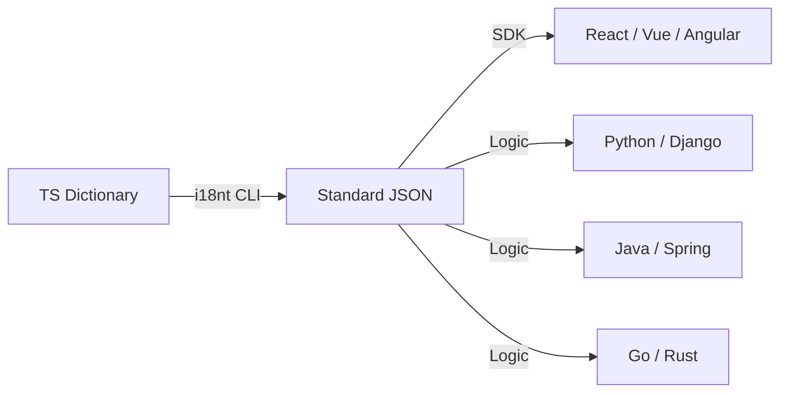

# i18nt

> 极致轻量的国际化框架 — 零依赖 · Proxy 驱动 · ICU 标准化 · 嵌套命名空间

简体中文 | [English](./README.en.md)

[](https://www.npmjs.com/package/@xiaode-ai/i18nt)
[](https://bundlephobia.com/package/@xiaode-ai/i18nt)
[](https://github.com/xiaode-ai/i18nt/blob/main/LICENSE)

## ✨ 特性

- **🚀 极速启动**：基于 **Recursive Proxy**，仅在访问时生成路径，初始化性能恒定为 **O(1)**，完美支持无限级嵌套。
- **📦 零依赖**：核心代码 **< 3KB** (gzip)，不引入任何第三方库。
- **🎯 ICU 标准化**：内置精简版 ICU 解析器，支持 `plural`, `select`, `skeleton` (::yMMMd) 等高级语法。
- **🛡️ 深度类型安全**：**[NEW]** 自动从 ICU 字符串中提取变量名，实现编译时的参数校验与智能补全。
- **🎨 富文本支持**：内置 `<tag>` 语法支持，可轻松插入 React/Vue 组件或 HTML 标签。
- **⚛️ 框架全适配**：原生支持 React (Hook/RSC), Vue 3, Angular, Next.js, React Native。
- **🛠️ 智能化 CLI**：**[NEW]** 支持源码自动提取、字典自动修复及 **AI 自动化翻译补全**。
- **🌐 插件生态**：提供浏览器探测、持久化缓存及 **[NEW] 跨标签页状态同步** 插件。

## 📦 安装

```bash
npm i @xiaode-ai/i18nt
```

## 🚀 快速上手

### 1. 定义翻译字典

```ts
// src/i18n/dict.ts
export const LANG_ORDER = ["zh-CN", "en-US"] as const;

export const TRANSLATIONS = {
  // 基础文本
  buttons: {
    save: ["保存", "Save"],
  },
  // ICU MessageFormat
  cart: [
    "{count, plural, =0{空购物车} other{购物车中有 # 件商品}}",
    "{count, plural, =0{Empty} other{# items in cart}}",
  ],
};
```

### 2. 初始化并使用

```ts
import { createI18n } from "@xiaode-ai/i18nt";
import { TRANSLATIONS, LANG_ORDER } from "./i18n/dict";

const i18n = createI18n({
  translations: TRANSLATIONS,
  langOrder: LANG_ORDER,
  locale: "zh-CN",
});

const { t } = i18n;

// Proxy 驱动的属性访问，享受完美类型提示
console.log(t.buttons.save); // "保存"

// 函数式调用处理 ICU 逻辑
console.log(t("cart", { count: 3 })); // "购物车中有 3 件商品"

// 富文本标签支持
const result = t("agree", { 
  link: (text) => `<a href="/terms">${text}</a>` 
}); // ["请阅读 ", "<a href="/terms">使用协议</a>"]
```

## ⚛️ React 集成

`i18nt` 提供了官方 React 适配层，支持全局状态管理与组件级重绘。

### 配置 Provider

```tsx
import { I18nProvider } from "@xiaode-ai/i18nt/react";

function Root() {
  return (
    <I18nProvider config={{ translations, langOrder, locale: 'zh-CN' }}>
      <App />
    </I18nProvider>
  );
}
```

### 在组件中使用

```tsx
import { useI18n } from "@xiaode-ai/i18nt/react";

function UserProfile() {
  const { t, setLocale, locale } = useI18n();

  return (
    <div>
      <p>{t.profile.welcome}</p>
      <button onClick={() => setLocale('en-US')}>Switch to English</button>
    </div>
  );
}
```

## 🛠️ CLI 进阶：分布式翻译管理

对于大型项目，建议将翻译字典分散在各业务模块中。`i18nt` CLI 可以自动聚合它们。

### 目录结构示例
```text
src/
  auth/
    i18n.ts      // 定义 auth 命名空间
  settings/
    i18n.ts      // 定义 settings 命名空间
```

### 自动化操作
```bash
# 1. 校验并自动修复翻译字典（自动补全缺失语言项、格式化等）
npx i18nt fix --input src/

# 2. [NEW] 调用 AI 自动补全缺失的翻译（支持自定义 API 供应商）
$env:I18NT_AI_API_KEY="sk-xxx"
npx i18nt translate

# 3. 递归扫描 src/ 目录，自动基于文件名聚合命名空间并导出 JSON
npx i18nt export --input src/ --lang all --json ./.i18nt/locales/

# 4. [NEW] 扫描源码，自动提取翻译 Key 并更新字典
npx i18nt extract --input src/

# 5. [NEW] 导出为各平台原生格式 (Python, PHP, Go, Android, iOS)
npx i18nt export --format py      # 导出 .py 字典
npx i18nt export --format xml     # 导出 Android strings.xml
npx i18nt export --format strings # 导出 iOS .strings
```

### 🤖 AI 翻译配置 (Optional)
支持通过环境变量配置任何兼容 OpenAI 格式或 Gemini 的 API：
- `I18NT_AI_PROVIDER`: `openai` (默认) 或 `gemini`
- `I18NT_AI_API_HOST`: 自定义 API 域名
- `I18NT_AI_MODEL`: 指定模型名称

## 🛡️ TypeScript 类型安全

得益于 **Recursive Proxy**，您只需定义好基础字典，即可在任何地方获得全自动的代码补全：

```ts
// 1. 即使是 10 层嵌套，i18nt 也能准确推导出类型
t.a.b.c.d.e.f.g.h.i.j; 

// 2. [NEW] 自动提取 ICU 变量
// 如果字典中为 "{count} items"
t.cart({ count: 3 }); // ✅ 自动校验参数，缺失 count 将报错
```

## 🧩 插件系统

```ts
import { browserDetector, languageCache, syncPlugin } from "@xiaode-ai/i18nt/plugins";

const i18n = createI18n({
  plugins: [
    browserDetector(), // 自动探测浏览器语言
    languageCache(),   // 自动持久化到 localStorage
    syncPlugin()       // [NEW] 跨浏览器标签页实时同步语言状态
  ]
});
```

## ⚔️ 库对比

| 特性 / 库                     | i18nt |  i18next  | FormatJS |
| :---------------------------- | :---: | :-------: | :------: |
| **体积 (Gzip)**               | **< 3KB** |  ~40KB    |  ~30KB   |
| **零依赖**                    |  ✅   |    ❌     |    ❌    |
| **Proxy 驱动 (类型补全)**     |  ✅   |    ❌     |    ❌    |
| **核心 ICU 语法支持**         |  ✅   | ✅ (插件) |    ✅    |
| **RTL 自动同步**              |  ✅   |    ❌     |    ❌    |
| **源码自动提取**              |  ✅   |  ✅(插件)  |    ✅    |
| **富文本组件插值**            |  ✅   |    ✅     |    ✅    |

## 🌍 跨语言与多端支持

`i18nt` 核心零依赖，并为各类流行框架和后端语言提供了全方位的适配方案：

### 1. 前端框架原生适配
针对前端生态，我们提供了深度的 API 集成，确保极致的开发体验：

- **🟢 Vue 3**: 提供插件支持 `app.use(createI18nPlugin(...))`。
- **🌍 Next.js (App Router)**: 原生支持 Server Components (RSC) 与中间件重定向。
- **📱 React Native**: 自动同步系统级 RTL 状态，支持原生端渲染。
- **🅰️ Angular**: 支持 Signal 响应式与 Pipe 语法。

### 2. 跨语言后端支持 (Python, Java, Go, Rust)
虽然 `i18nt` 核心是 JS/TS，但其 **CLI 工具链** 和 **ICU 标准协议** 使其能完美支持任何编程语言的项目：

- **标准协议**: 基于 **ICU MessageFormat**，导出的逻辑在各端完全通用。
- **原生导出**: CLI 支持通过 `--format` 一键导出 `.py`, `.php`, `.go`, `.rs`, `.xml`, `.strings` 等格式。
- **唯一事实来源 (SSOT)**: 在 TS 中定义业务逻辑，一键同步给全栈。



### 3. 环境兼容性
- **浏览器**: 支持 Chrome, Edge, Safari, Firefox 等现代浏览器 (需支持 Proxy)。
- **Node.js**: 支持 14.x+ 版本，适用于 CLI 工具和服务端渲染。
```ts
import { createApp } from 'vue';
import { createI18nPlugin } from '@xiaode-ai/i18nt/vue';

const app = createApp(App);
app.use(createI18nPlugin({ translations, langOrder, locale: 'zh-CN' }));
```

### 🌍 Next.js (App Router)
支持 Server Components (RSC)：
```tsx
import { getI18nServer } from '@xiaode-ai/i18nt/next';

export default async function Page() {
  const i18n = getI18nServer(config, 'en-US');
  return <h1>{i18n.t.welcome}</h1>;
}
```

### 🛣️ 路由与中间件 (Middleware)
利用内置助手轻松实现语言重定向：
```ts
// middleware.ts
import { createI18nMiddleware } from '@xiaode-ai/i18nt/next';

export const middleware = createI18nMiddleware({
  locales: ['zh-CN', 'en-US'],
  defaultLocale: 'zh-CN'
});

export const config = {
  matcher: ['/((?!api|_next/static|_next/image|favicon.ico).*)']
};
```

### 📱 React Native
自动同步原生 RTL 状态：
```tsx
import { I18nNativeProvider } from '@xiaode-ai/i18nt/native';

function App() {
  return (
    <I18nNativeProvider config={config}>
      <Main />
    </I18nNativeProvider>
  );
}
```

### 🅰️ Angular
支持 Signal 与 Pipe：
```ts
// app.config.ts
providers: [
  provideI18n(config) // 或共享实例 provideI18n(sharedI18n)
]

// component.html
<p>{{ 'welcome' | t }}</p>
```

## 🧩 高级进阶：按需加载命名空间

对于大型项目，您可以配置动态加载器：

```ts
const i18n = createI18n({
  locale: 'zh-CN',
  loaders: {
    admin: () => import('./locales/admin.ts'),
    settings: () => import('./locales/settings.ts')
  }
});

// 在需要时加载
await i18n.loadNamespace('admin');
```

## 🛠️ 环境兼容性与自定义格式化器

如果运行在不支持原生 `Intl` 的老旧环境，你可以通过 `formatters` 覆盖默认实现：

```ts
const i18n = createI18n({
  formatters: {
    formatNumber: (val) => myPolyfill.format(val),
    formatDate: (date) => customDateLib(date)
  }
});
```

## ☁️ 远程字典与 OTA (Over-The-Air)

无需重新发布代码，即可更新翻译：

```ts
const i18n = createI18n({
  otaLoader: async (locale) => {
    const res = await fetch(`https://api.tms.com/locales/${locale}`);
    return res.json();
  }
});

// setLocale 会自动触发 otaLoader
await i18n.setLocale('en-US');
```

## 📄 开源协议

MIT
